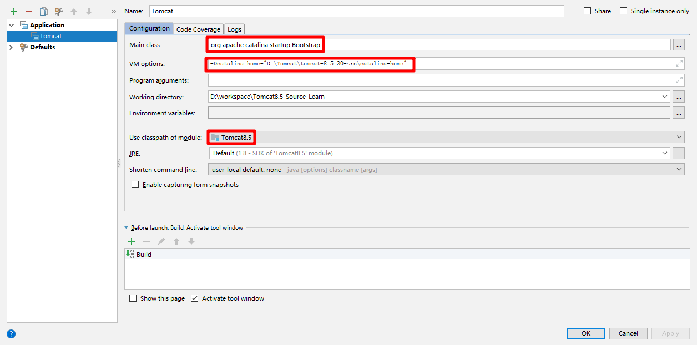

## Welcome to Apache Tomcat!

###源码导入配置
- 首先下载源码包和程序包，并且都解压出来
- 在源码文件夹中新建一个 catalina-home 文件夹，把程序内容复制到其中
- 在源码文件夹中添加一个 pom 文件

      <?xml version="1.0" encoding="UTF-8"?>  
      <project xmlns="http://maven.apache.org/POM/4.0.0"  
               xmlns:xsi="http://www.w3.org/2001/XMLSchema-instance"  
               xsi:schemaLocation="http://maven.apache.org/POM/4.0.0 http://maven.apache.org/xsd/maven-4.0.0.xsd">  
      
          <modelVersion>4.0.0</modelVersion>  
          <groupId>org.apache.tomcat</groupId>  
          <artifactId>Tomcat8.5</artifactId>  
          <name>Tomcat8.5</name>  
          <version>8.5.30</version>  
      
          <dependencies>  
              <dependency>  
                  <groupId>junit</groupId>  
                  <artifactId>junit</artifactId>  
                  <version>4.12</version>  
                  <scope>test</scope>  
              </dependency>  
              <dependency>  
                  <groupId>org.easymock</groupId>  
                  <artifactId>easymock</artifactId>  
                  <version>3.4</version>  
              </dependency>  
              <dependency>  
                  <groupId>org.apache.ant</groupId>  
                  <artifactId>ant</artifactId>  
                  <version>1.10.1</version>  
              </dependency>  
              <dependency>  
                  <groupId>wsdl4j</groupId>  
                  <artifactId>wsdl4j</artifactId>  
                  <version>1.6.2</version>  
              </dependency>  
              <dependency>  
                  <groupId>javax.xml</groupId>  
                  <artifactId>jaxrpc</artifactId>  
                  <version>1.1</version>  
              </dependency>  
              <dependency>  
                  <groupId>org.eclipse.jdt</groupId>  
                  <artifactId>org.eclipse.jdt.core</artifactId>  
                  <version>3.13.0</version>  
              </dependency>  
          </dependencies>  
      
          <build>  
              <finalName>Tomcat8.5</finalName>  
              <sourceDirectory>java</sourceDirectory>  
              <testSourceDirectory>test</testSourceDirectory>  
              <resources>  
                  <resource>  
                      <directory>java</directory>  
                  </resource>  
              </resources>  
              <testResources>  
                  <testResource>  
                      <directory>test</directory>  
                  </testResource>  
              </testResources>  
              <plugins>  
                  <plugin>  
                      <groupId>org.apache.maven.plugins</groupId>  
                      <artifactId>maven-compiler-plugin</artifactId>  
                      <version>2.3</version>  
                      <configuration>  
                          <encoding>UTF-8</encoding>  
                          <source>1.8</source>  
                          <target>1.8</target>  
                      </configuration>  
                  </plugin>  
              </plugins>  
          </build>  
      
      </project>  
- 修改intellij 文件启动配置 
  - 文件以 maven 项目导入
  - 配置如下：
  - 
  - run 完美启动。

